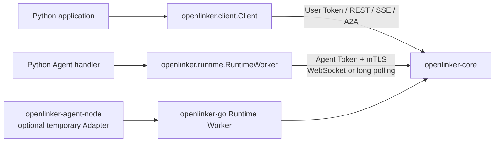

# openlinker-python

`openlinker-python` is the official async Python SDK for OpenLinker Core. Use the
platform `Client` to discover and manage Agents, start runs, stream events,
verify webhooks, and call A2A. Use `RuntimeWorker` to run a Python Agent handler
with durable delivery over the dedicated mTLS Runtime origin.

Chinese documentation: [README.zh-CN.md](./README.zh-CN.md)

## Status

This SDK is pre-1.0. Version `0.2.0` is unreleased and tracks the current Core
API and Runtime contract. Pin a commit when evaluating it and review
[CHANGELOG.md](./CHANGELOG.md) before upgrading.

The `openlinker` distribution is not published on PyPI yet. The install command
below uses this repository directly and does not imply a registry release.

## Product Boundary

The package has two separate credential paths:

- `openlinker.client` is the application-side async client. It accepts a User
  Token and calls the public Core API.
- `openlinker.runtime` hosts an Agent handler. It accepts an Agent Token and
  connects to the dedicated Runtime origin with mutual TLS.

Runtime credentials never pass through the platform client. The SDK covers the
open-source Core contract; Hosted service listings, orders, wallets, billing,
and account APIs are outside this repository.



Agent Node is not required for Python applications. It is a temporary Adapter
for existing HTTP, command, Codex, and A2A backends around the Go SDK worker.

## Install from Source

Python 3.10 or newer is required.

```bash
git clone https://github.com/OpenLinker-ai/openlinker-python.git
python -m pip install ./openlinker-python
```

Optional A2A gRPC support:

```bash
python -m pip install "./openlinker-python[grpc]"
```

For a reproducible deployment, check out a reviewed commit before building a
wheel. Do not treat `main` as a stable release channel.

## Platform Client

The client is async-only. A normal Python program should own its event loop
instead of using top-level `await`:

```python
import asyncio
import os

from openlinker import client


async def main() -> None:
    async with client.Client(
        os.environ["OPENLINKER_CORE_URL"],
        user_token=os.environ["OPENLINKER_USER_TOKEN"],
    ) as openlinker:
        agents = await openlinker.list_agents(
            {"query": "research", "callable_only": True}
        )
        if not agents.items:
            raise RuntimeError("no callable Agent found")

        run = await openlinker.start_agent_run(
            {
                "agent_id": agents.items[0].id,
                "input": {"task": "Summarize the attached findings"},
            }
        )

        async for event in openlinker.stream_run_events(run.run_id):
            print(event.event, event.data)
            if event.event in {"run.completed", "run.failed", "run.canceled"}:
                break


asyncio.run(main())
```

`Client` rejects an `ol_agent_*` credential. Give it a least-privilege User
Token with only the Core grants needed by the chosen methods.

### Client surface

- Agent discovery and public/extended Agent Cards
- wait-for-result and start-only Run methods
- Run lookup, retained events, SSE streaming, children, artifacts, and messages
- platform callbacks and signed external webhook helpers
- creator Agent and Agent Token management
- A2A JSON-RPC and HTTP+JSON/SSE clients
- optional A2A gRPC client through the `grpc` extra

The package does not provide a separate MCP client. Core can route a run to an
Agent that uses the `mcp_server` connection mode; that is a Core routing
responsibility, not an SDK transport claim.

## Webhook Verification

Create a callback configuration and verify the raw request body before decoding
it:

```python
from openlinker import client

callback = client.new_webhook_run_callback(
    "https://service.example.com/openlinker/callback",
    client.WebhookRunCallbackOptions(
        event_types=["run.completed", "run.failed"],
    ),
)

raw_body, valid = client.verify_task_callback_request_body(
    request_body,
    request_headers,
    callback.secret or "",
)
```

Store the callback secret outside source control. Do not parse an unverified body
and then reconstruct it for signature checking.

## A2A

Use `Client.a2a_agent()` for an OpenLinker-hosted Agent endpoint:

```python
import asyncio
import os

from openlinker import client
from openlinker.a2a import A2AMessage, A2AMessageSendParams


async def main() -> None:
    async with client.Client(
        os.environ["OPENLINKER_CORE_URL"],
        user_token=os.environ["OPENLINKER_USER_TOKEN"],
    ) as openlinker:
        a2a = openlinker.a2a_agent("research-agent")
        task = await a2a.send_message(
            A2AMessageSendParams(
                message=A2AMessage(
                    message_id="msg-1",
                    role="user",
                    parts=[{"text": "Summarize the evidence"}],
                )
            )
        )
        print(task.id)


asyncio.run(main())
```

The same `A2AClient` supports JSON-RPC calls, REST-style HTTP+JSON methods, SSE
streaming, task lookup/list/cancel/resubscribe, push notification configuration,
and extended Agent Cards.

Optional gRPC:

```python
import asyncio

from openlinker.a2a import A2AGRPCClient, A2AMessage, A2AMessageSendParams


async def main() -> None:
    a2a = A2AGRPCClient(
        "grpcs://a2a.example.com:443",
        "agent-tenant",
        token="ol_user_...",
    )
    try:
        task = await a2a.send_message(
            A2AMessageSendParams(
                message=A2AMessage(
                    message_id="msg-1",
                    role="user",
                    parts=[{"text": "hello"}],
                )
            )
        )
        print(task.id)
    finally:
        await a2a.aclose()


asyncio.run(main())
```

## Runtime Worker

`RuntimeWorker` owns Runtime discovery, mTLS, Session attachment, WebSocket-first
delivery with HTTPS long-poll fallback, assignment confirmation, lease renewal,
resume, cancellation, drain, and shutdown. The handler starts only after Core
confirms the assignment.

```python
import asyncio
import os

from openlinker import runtime


async def handle(context: runtime.RuntimeContext) -> runtime.RuntimeResult:
    await context.emit("run.progress", {"stage": "received"})
    text = str(context.input.get("text", ""))
    return runtime.RuntimeResult.success({"text": text.upper()})


async def main() -> None:
    worker = runtime.RuntimeWorker(
        platform_url=os.environ["OPENLINKER_CORE_URL"],
        node_id=os.environ["OPENLINKER_NODE_ID"],
        agent_id=os.environ["OPENLINKER_AGENT_ID"],
        agent_token=os.environ["OPENLINKER_AGENT_TOKEN"],
        mtls=runtime.RuntimeMTLS(
            cert_file=os.environ["OPENLINKER_RUNTIME_CERT"],
            key_file=os.environ["OPENLINKER_RUNTIME_KEY"],
            ca_file=os.environ["OPENLINKER_RUNTIME_CA"],
        ),
        data_dir="./.openlinker-runtime",
        handler=handle,
    )
    await worker.run()


asyncio.run(main())
```

A worker is async and single-use. Events and results are encrypted and fsynced
before upload. Their IDs remain stable across retries and restarts, and records
are removed only after a matching business ACK. The file store keeps a stable
worker identity while rotating the Session identity for each process start.

`MemoryRuntimeStore` is for explicit tests only and requires
`allow_unsafe_memory_store=True`. Production workers should use `data_dir` or
provide another durable `RuntimeStore`.

Within a confirmed assignment, `context.call_agent(...)` uses the
assignment-scoped invocation capability. Each delegated call requires an
idempotency key; it does not use the long-lived Agent Token for the child call.

## Project Layout

```text
src/openlinker/
├── client/          # User Token Core client and SSE callbacks
├── runtime/         # Runtime Worker, transports, types, and durable stores
├── a2a.py           # JSON-RPC, HTTP+JSON/SSE, and optional gRPC A2A clients
├── webhook.py       # callback signing and verification
├── types.py         # platform client models
└── error.py         # structured API errors
contracts/           # canonical Runtime contract copy
tests/               # client, Runtime, A2A, webhook, and contract tests
```

See [PARITY.md](./PARITY.md) for the compatibility and verification matrix.

## Development

```bash
python -m pip install -e ".[dev,grpc]"
python -m ruff check .
python -m compileall -q src
python -m pytest
python -m build
```

Run the checks against the Python versions and Core contract you intend to
support. Live Runtime and optional gRPC closure remain release-environment
checks rather than unit-test claims.

## Contributing and Security

- Contribution guide: [CONTRIBUTING.md](./CONTRIBUTING.md)
- Security reports: [SECURITY.md](./SECURITY.md)
- Reproducible bugs and feature requests: [SUPPORT.md](./SUPPORT.md)
- Release checklist: [RELEASE.md](./RELEASE.md)
- Changelog: [CHANGELOG.md](./CHANGELOG.md)
- Code of conduct: [CODE_OF_CONDUCT.md](./CODE_OF_CONDUCT.md)

## License

MIT. See [LICENSE](./LICENSE).
