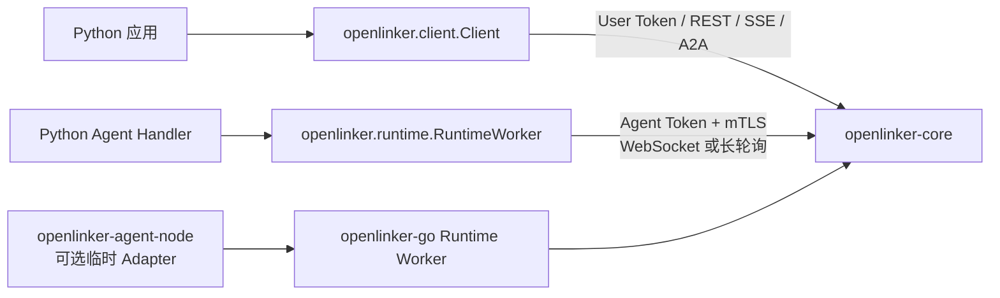

# openlinker-python

`openlinker-python` 是 OpenLinker Core 的官方异步 Python SDK。应用可以用
`Client` 发现和管理 Agent、启动 Run、订阅事件、验证 Webhook 和调用 A2A；Python
Agent 可以用 `RuntimeWorker` 通过专用 mTLS Runtime 入口可靠接收并执行任务。

English documentation: [README.md](./README.md)

## 状态

本 SDK 处于 pre-1.0。`0.2.0` 尚未发布，跟随当前 Core API 和 Runtime 契约演进。
评估时请固定 commit，升级前阅读 [CHANGELOG.md](./CHANGELOG.md)。

`openlinker` distribution 尚未发布到 PyPI。下方安装命令直接使用本仓库，不代表已经存在
registry release。

## 产品边界

包内有两条相互分离的凭据路径：

- `openlinker.client` 是应用侧异步客户端，使用 User Token 调用 Core 公共 API；
- `openlinker.runtime` 运行 Agent Handler，使用 Agent Token 和双向 TLS 连接专用
  Runtime origin。

Runtime 凭据不会经过平台 Client。SDK 只覆盖开源 Core 契约，不包含 Hosted 服务商品、
订单、钱包、计费和账号 API。



Python 应用不需要 Agent Node。Agent Node 只是包在 Go SDK Worker 外、用于接入已有
HTTP、命令、Codex 和 A2A backend 的临时 Adapter。

## 从源码安装

需要 Python 3.10 或更高版本。

```bash
git clone https://github.com/OpenLinker-ai/openlinker-python.git
python -m pip install ./openlinker-python
```

需要 A2A gRPC 时安装可选依赖：

```bash
python -m pip install "./openlinker-python[grpc]"
```

部署时应先 checkout 已审核的 commit 再构建 wheel，不要把 `main` 当作稳定发布渠道。

## 平台 Client

Client 只有异步接口。普通 Python 程序应显式管理事件循环，不使用只能在交互环境运行的
顶层 `await`：

```python
import asyncio
import os

from openlinker import client


async def main() -> None:
    async with client.Client(
        os.environ["OPENLINKER_URL"],
        user_token=os.environ["OPENLINKER_USER_TOKEN"],
    ) as openlinker:
        agents = await openlinker.list_agents(
            {"query": "research", "callable_only": True}
        )
        if not agents.items:
            raise RuntimeError("no callable Agent found")

        run = await openlinker.start_agent_run(
            {
                "agent_id": agents.items[0].id,
                "input": {"task": "Summarize the attached findings"},
            }
        )

        async for event in openlinker.stream_run_events(run.run_id):
            print(event.event, event.data)
            if event.event in {"run.completed", "run.failed", "run.canceled"}:
                break


asyncio.run(main())
```

`Client` 会拒绝 `ol_agent_*` 凭据。传入的 User Token 应只包含相应方法需要的最小
Core grants。

### Client 能力

- Agent 发现、公开和扩展 Agent Card
- 等待结果与仅启动两种 Run 方法
- Run 查询、保留事件、SSE 订阅、子 Run、Artifact 和消息
- 平台 callback 与外部签名 Webhook 辅助函数
- 创建者 Agent 与 Agent Token 管理
- A2A JSON-RPC 和 HTTP+JSON/SSE 客户端
- 通过 `grpc` extra 提供的可选 A2A gRPC 客户端

本包没有独立 MCP client。Core 可以把 Run 路由到 `mcp_server` 连接模式的 Agent；
这是 Core 的路由职责，不代表 SDK 自己实现了 MCP transport。

## Webhook 验证

创建 callback 配置后，应先验证原始请求体，再进行解码：

```python
from openlinker import client

callback = client.new_webhook_run_callback(
    "https://service.example.com/openlinker/callback",
    client.WebhookRunCallbackOptions(
        event_types=["run.completed", "run.failed"],
    ),
)

raw_body, valid = client.verify_task_callback_request_body(
    request_body,
    request_headers,
    callback.secret or "",
)
```

Callback secret 应保存在源码之外。不要先解析未经验证的正文，再重新序列化做签名校验。

## A2A

调用 OpenLinker 中的 Agent 时，可以从 `Client.a2a_agent()` 创建客户端：

```python
import asyncio
import os

from openlinker import client
from openlinker.a2a import A2AMessage, A2AMessageSendParams


async def main() -> None:
    async with client.Client(
        os.environ["OPENLINKER_URL"],
        user_token=os.environ["OPENLINKER_USER_TOKEN"],
    ) as openlinker:
        a2a = openlinker.a2a_agent("research-agent")
        task = await a2a.send_message(
            A2AMessageSendParams(
                message=A2AMessage(
                    message_id="msg-1",
                    role="user",
                    parts=[{"text": "Summarize the evidence"}],
                )
            )
        )
        print(task.id)


asyncio.run(main())
```

同一个 `A2AClient` 还支持 JSON-RPC、REST 风格 HTTP+JSON、SSE、Task 查询/列表/
取消/重新订阅、Push Notification 配置和扩展 Agent Card。

可选 gRPC：

```python
import asyncio

from openlinker.a2a import A2AGRPCClient, A2AMessage, A2AMessageSendParams


async def main() -> None:
    a2a = A2AGRPCClient(
        "grpcs://a2a.example.com:443",
        "agent-tenant",
        token="ol_user_...",
    )
    try:
        task = await a2a.send_message(
            A2AMessageSendParams(
                message=A2AMessage(
                    message_id="msg-1",
                    role="user",
                    parts=[{"text": "hello"}],
                )
            )
        )
        print(task.id)
    finally:
        await a2a.aclose()


asyncio.run(main())
```

## Runtime Worker

`RuntimeWorker` 负责 Runtime 发现、token-only/mTLS 安全策略、Session attach、WebSocket 主链路与 HTTPS
长轮询回退、任务确认、租约续期、恢复、取消、drain 和关闭。只有 Core 确认任务后才会
执行 Handler。

```python
import asyncio
import os

from openlinker import runtime


async def handle(context: runtime.RuntimeContext) -> runtime.RuntimeResult:
    await context.emit("run.progress", {"stage": "received"})
    text = str(context.input.get("text", ""))
    return runtime.RuntimeResult.success({"text": text.upper()})


async def main() -> None:
    worker = runtime.RuntimeWorker(
        platform_url=os.environ["OPENLINKER_URL"],
        agent_id=os.environ["OPENLINKER_AGENT_ID"],
        agent_token=os.environ["OPENLINKER_AGENT_TOKEN"],
        data_dir=os.environ.get(
            "OPENLINKER_RUNTIME_DATA_DIR",
            "./.openlinker-runtime",
        ),
        transport=os.environ.get("OPENLINKER_RUNTIME_TRANSPORT", "auto"),
        handler=handle,
    )
    await worker.run()


asyncio.run(main())
```

发现选择 token-only 且省略 `node_id` 时，SDK 会派生与 Go/TypeScript SDK 一致、仅限该
Agent Token 的稳定 Node ID。发现要求 mTLS 时由 SDK 自动登记；只有外部 PKI 兼容模式才需
显式证书文件。

Worker 是异步且一次性的。Event 和 Result 会在上传前加密并 fsync；重试和重启不会改变
它们的 ID，只有取得匹配的业务 ACK 后才会删除记录。文件 Store 会保留稳定的 worker
identity，并在每次进程启动时更换 Session identity。

`MemoryRuntimeStore` 只用于显式测试，并要求 `allow_unsafe_memory_store=True`。生产
Worker 应使用 `data_dir` 或提供其他持久化 `RuntimeStore`。

在已经确认的任务中，`context.call_agent(...)` 使用本次任务专用的 invocation
capability。每次委派调用必须提供幂等键，不会使用长效 Agent Token 发起子调用。

## 项目结构

```text
src/openlinker/
├── client/          # User Token Core Client 与 SSE callback
├── runtime/         # Runtime Worker、transport、类型和持久 Store
├── a2a.py           # JSON-RPC、HTTP+JSON/SSE 与可选 gRPC A2A 客户端
├── webhook.py       # callback 签名与验证
├── types.py         # 平台 Client 模型
└── error.py         # 结构化 API 错误
contracts/           # Runtime 标准契约副本
tests/               # Client、Runtime、A2A、Webhook 与契约测试
```

兼容范围和验证矩阵见 [PARITY.zh-CN.md](./PARITY.zh-CN.md)。

## 开发

```bash
python -m pip install -e ".[dev,grpc]"
python -m ruff check .
python -m compileall -q src
python -m pytest
python -m build
```

应在准备支持的 Python 版本和 Core 契约上运行检查。真实 Runtime 与可选 gRPC 闭环属于
发布环境检查，不能用单元测试结果代替。

## 贡献与安全

- 贡献指南：[CONTRIBUTING.zh-CN.md](./CONTRIBUTING.zh-CN.md)
- 安全报告：[SECURITY.zh-CN.md](./SECURITY.zh-CN.md)
- 可复现问题与功能建议：[SUPPORT.zh-CN.md](./SUPPORT.zh-CN.md)
- 发布清单：[RELEASE.zh-CN.md](./RELEASE.zh-CN.md)
- 变更记录：[CHANGELOG.md](./CHANGELOG.md)
- 行为准则：[CODE_OF_CONDUCT.md](./CODE_OF_CONDUCT.md)

## 许可证

MIT。详见 [LICENSE](./LICENSE)。
